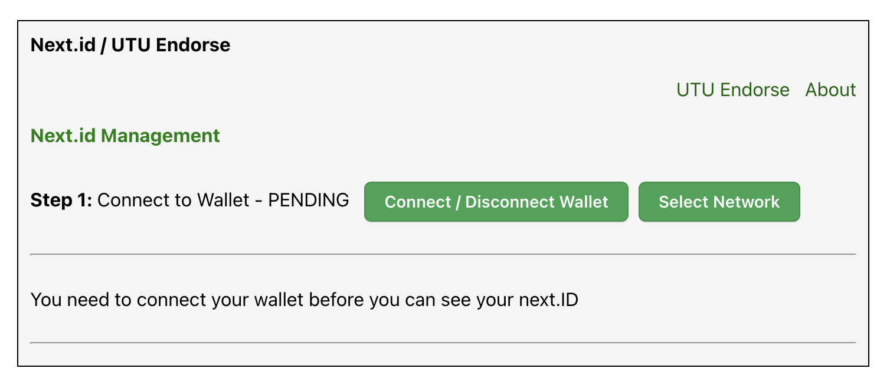
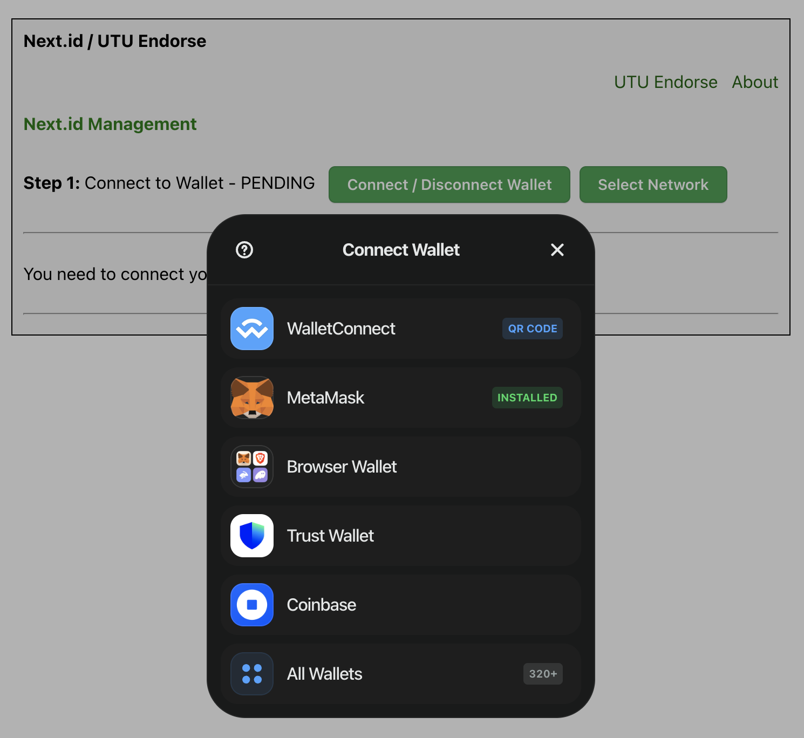
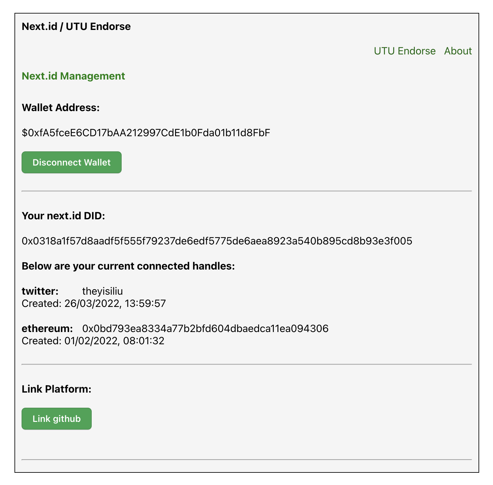
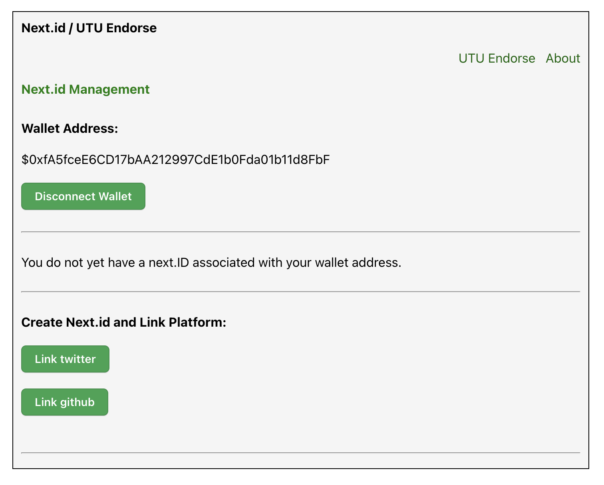
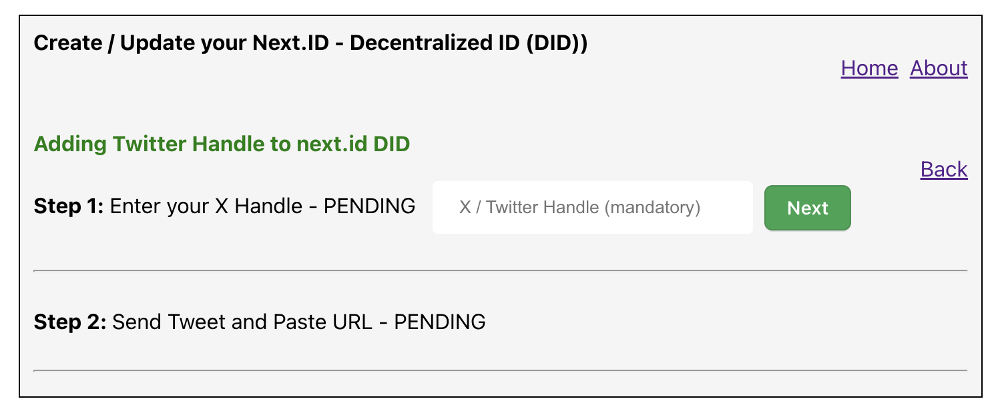
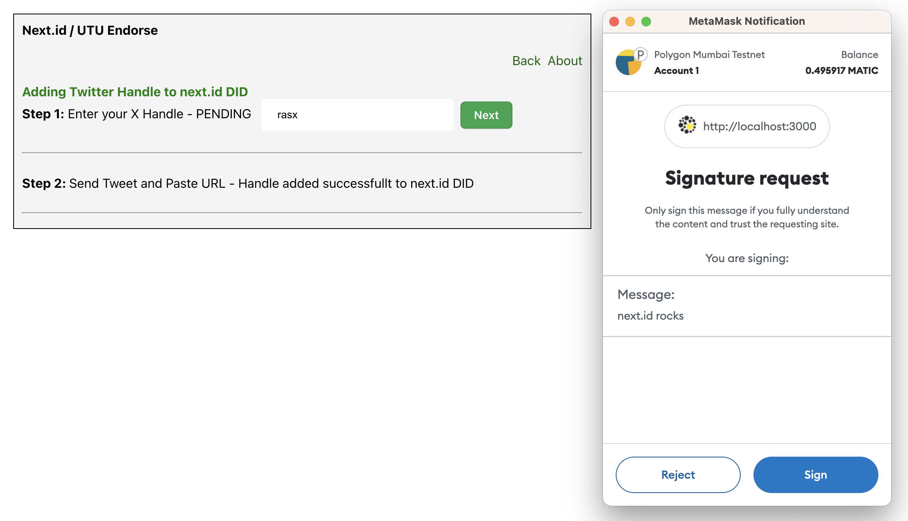
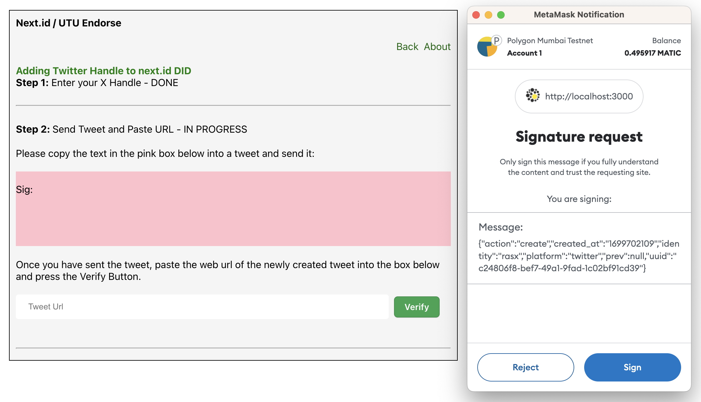
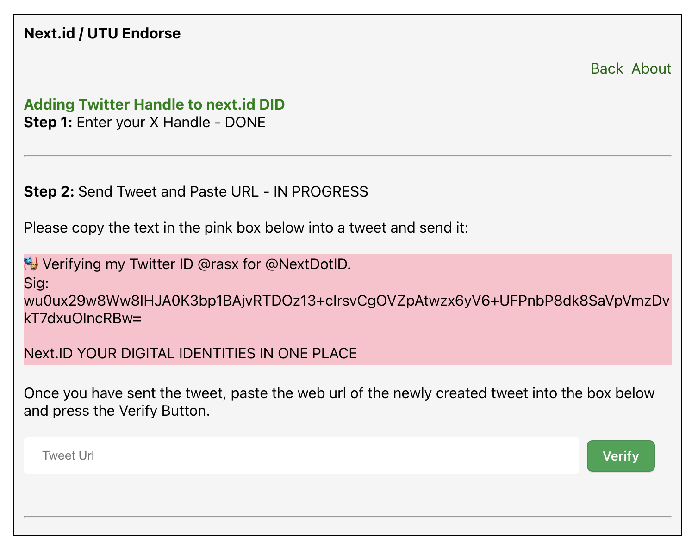

# README

**NOTE:** Update 18th January 2024:

This project is not operational at the very moment. Some code is being ported into this project from here:

https://github.com/spotadev/next-id-wallet

Check back here later and you will see a new status when the task has been completed.

## utu-endorse-nextid

This is a react project which implements next.id to allow users to link their different social 
media accounts to a Universal Decentralised ID.

This app also integrates the UTU Trust network to allow users to endorse Universal IDs with tags.

For example you could endorse someone as being a full stack JavaScript Developer or a Vegan Chef.

This inniative makes it harder for Bots and Fake Accounts to push false narratives.  It improves 
trust in both the Web 2 and Web 3 space.

### Install and run example

(i) mkdir ~/workspace

(ii) cd workspace

(iii) git clone https://github.com/spotadev/utu-endorse-nextid.git

(iv) cd utu-endorse-nextid

(v) Copy .env.local.sample to .env.local
    Copy .env.staging.sample to .env.staging
    Copy .env.production.sample to .env.production

(vi) Go to https://cloud.walletconnect.com/sign-in and get your projectId.  Put it in the env files you copied above

(vii) npm install

(viii) Now start the app in local dev mode:

  Note that App.tsx has the following code in it:

    const environment = process.env.REACT_APP_ENVIRONMENT;
    console.log('environment', environment);

  When you run the above "npm run start" command it will choose your .env.local file and print:

    environment local

  The other environment files are required for when you run the staging or production builds:

    npm run build:production

(ix) Open app in web browser:  http://localhost:3000/

(x) You will see:

(a) This is the first screen.  It shows a button to connect to your wallet: 

  

(b) Click the above Connect button and you get this:

  

(c) Once connected you will see your next.id DID if you have one already:

  

(c alternate) If you do not have a next.id DID you see this:

  

(d) Clicking on the above "Link Twitter" button takes you to a new screen:

  

(e) Filling in your Twitter handle in the above screen and clicking next pops up this screen where you are asked to sign some text.  This is done to enable the dApp to retrieve your public key.

  

(f) You then sign a payload we about to send to next.id:

  

(g) Here you are shown some text in a pink box to create a tweet from.  You copy and paste the text into a tweet and send it and then paste the url of the tweet into the box and press verify.

  

(h) If you are verified successfully you are redirected to step 2 where you will see that your twitter handle has been added to your next.id DID.

NOTE: The code is still experimental so the above flow may change a bit.

 ### Resources

  [https://next.id/](https://next.id/)

  [https://www.youtube.com/watch?v=EZRjSlaHFZQ&t=7s](https://www.youtube.com/watch?v=EZRjSlaHFZQ&t=7s)

  [https://docs.utu.io/](https://docs.utu.io/)

  [https://github.com/NextDotID/sdk-example/tree/main/src](https://github.com/NextDotID/sdk-example/tree/main/src)

  [https://github.com/NextDotID/Signature-Generating-Sample/blob/main/typescript/src/index.ts](https://github.com/NextDotID/Signature-Generating-Sample/blob/main/typescript/src/index.ts)

### Background

next.id allows you to link your web 3 wallet addresses with your web 2 social media handles.

Althought there are apps like mask that are built on top of next.id there do not seem to be any
generic dapps that concentrate on helping the users link all of their web 2 and web 3 identifiers
together.

For example mask is more about sending encrypted tweets.

The idea is that we create a GUI that assists end users in linking their web 2 and web 3 accounts 
to a Universal ID.  We then provide the users the ability to endorse those who have a Universal 
ID using the UTU Trust SDK.

Endorsements occur with tags.

For example you could endorse:

    Universal-ID/tag

Tags show a specialisation of the person you are endorsing.

For example tags could be:

* Full Stack JavaScript Developer
* Vegan Chef

### Relationshop of this dApp with Symbiont

In Symbiont we show a Universal ID Icon for any user who has one that comments or creates a 
Comment Thread.

Clicking on the icon shows a page with details of the Universal ID and what UTU Trust endorsements 
that person has.

A Universal ID shows the Web 2 handles and Web 3 wallet addresses that the user linked using 
next.id.

### Project Visibility

This is an open source project and is visible to the public.  

Note that Symbiont is a private project that will make use of the utu-endorse-nextid app but the 
dApp will be a generic one that other projects can easily consume.